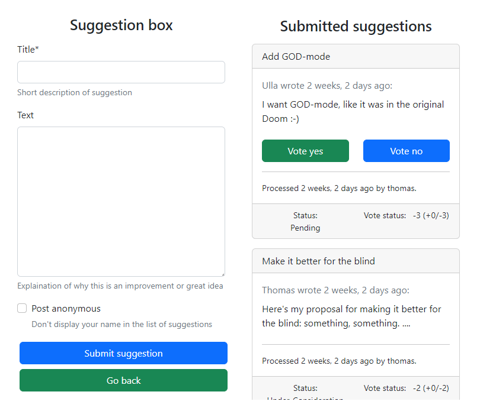

# django-suggestion-box

A reusable django app for managing suggestions from **authenticated users**, included up and down vote for suggestions.



## Installation

```
pip install -e git+git://github.com/weholt/django-suggestion-box.git#egg=suggestion_box
```

Add 'sveve' to your INSTALLED_APPS before 'django.contrib.admin':
```
INSTALLED_APPS = [
    "django.contrib.admin",
    ...
    "django.contrib.staticfiles",
    "suggestion_box",
    "crispy_forms",
    "crispy_bootstrap5",
]

CRISPY_ALLOWED_TEMPLATE_PACKS = "bootstrap5"
CRISPY_TEMPLATE_PACK = "bootstrap5"

```

Add the sveve urls to your global urls.py:
```
from django.contrib import admin
from django.urls import path, include

urlpatterns = [
    path('admin/', admin.site.urls),
    ...
    path("suggestion-box/", include("suggestion_box.urls"))
]
```

Since this app also uses htmx, add this to your template:
```
    <script src="//unpkg.com/htmx.org@1.1.0"></script>
    <script>
      document.body.addEventListener('htmx:configRequest', (event) => {
        event.detail.headers['X-CSRFToken'] = '{{ csrf_token }}';
      })
    </script>

```

For more information take a look at the example project included.

## Version history

0.1.0 :
 - Initial MVP - release.